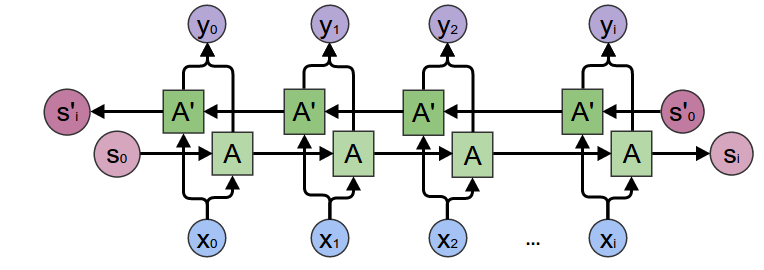

# Wikipedia-Traffic-Time-Series (Multi-Step Forecasting)

This competition focuses on the problem of forecasting the future values of multiple time series, as it has always been one of the most challenging problems in the field. More specifically, we aim the competition at testing state-of-the-art methods designed by the participants, on the problem of forecasting future web traffic for approximately 145,000 Wikipedia articles.

This competition will run as two stages and involves prediction of actual future events. There will be a training stage during which the leaderboard is based on historical data, followed by a stage where participants are scored on real future events.

## Data Exploration
The training dataset consists of approximately 145k time series. Each of these time series represent a number of daily views of a different Wikipedia article, starting from July, 1st, 2015 up until December 31st, 2016. The leaderboard during the training stage is based on traffic from January, 1st, 2017 up until March 1st, 2017. Each Wikipedia article is summarized in the 'page' column with the language of the article, the name of the article, the type of computer accessing the page, and the type of agent. See the notebooks folder for more information.

## Preprocessing

Since we are just using the univariate page views data for our model our preprocessing consists of handling missing values and moving the 'page' information to another dataframe. According to Kaggle:

   >Unfortunately, the data source for this dataset does not distinguish between traffic values of zero and missing values. A missing value may mean the traffic was zero or that the data is not available for that day.

To handle this we will first perform a rolling mean replacement for a 7 day range. This means that if there are legitimate missing values we will fill them in. Then we will fill the rest of the missing values with zeroes to represent no data collected or no data present. Further steps could be taken to adjust the RNN to accommodate the start of the data collection.

## The Model

##### Optimized Recurrent Neural Network (RNN)
The model uses a stacked bidirectional LTSM with two dense layers at the end with a single node as the output. Our model is trained on input data at time (t) and its target at time (t+60). This allows us to predict the time series 60 days in the future. To optimize the RNN we grid search the number of LTSM and dense layers alongside the number of nodes in each in a train/test split. We then let the model train and predict 60 days into the future. Shown below is a single bidirectional long term short memory (LTSM) layers representation.

## Performance

Kaggle score: We scored 355/375 out of the teams that participated in the competition with a SMAPE score of 97. Our score is much lower than expected for an RNN that was grid search optimized. I suspect than since I reduced the number of epochs to five (5) and did not reset the weights of the model every time series (to reduce training time), the model underfit the data. Further improvement to network structure and allowing more training time would yield better scores. Nonetheless the pipeline to download, build, train, and submit files is there so feel free to run it yourself. Here is a visual of the statistical performance.

### Run it yourself !
1) Download the dataset
  - run "src\download_data.py" from the project directory
  - you will need to install kaggle and get ur API key from their website
  - this script will create a folder of zipped csv files and  a few unzipped data files
2) Build the features  
  - run "src\build_features.py" from the project directory
  - this will transform the data and fill in any gaps in the records
3) Train the model
  - run "src\train.py" from the project directory
  - this will create predictions for both training sets
4) Build the submission files
  - run "src/4-build_submission.py" to make the files in the correct format for submission
5) Upload the results to Kaggle
  - fun "src/5-upload.py" from the project directory or submit the files manually to do so for you

The training and predicting of the forecaster will take around 2 days to complete. The other files will take less than 2 minutes to run.
