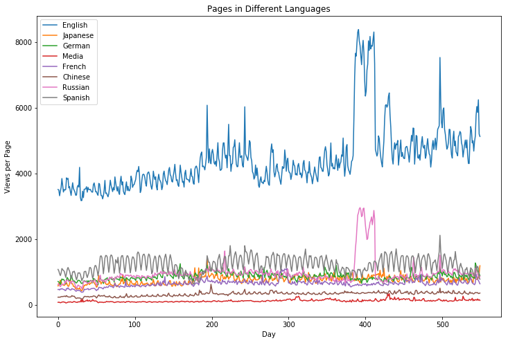

# Wikipedia-Traffic-Time-Series Notebooks

We have four notebooks in our Exploratory Data Analysis (EDA). See the summary of what we do in each notebook below.

This competitions goal is to predict the page views 60 days into the future. Since we will be using a recurrent neural network (RNN) for our model, we need some baseline predictions to show the effectiveness of more advanced techniques. We will first take a look at trends in the data, then show a few baseline forecasting techniques, before moving to more advanced statistical techniques.

### Data Exploration
We will take a dive into the dataset and the information that is provided. We will see which languages are viewed the most, what language most pages are published in, and the types of user and how they access the pages.

### Trends
We will investigate the trends, seasonality and the residuals of a time series from the dataset. Then we will plot some datetime statistics showing the days of the week, the weeks, and the months that have the most traffic alongside the average for each. Then we can plot autocorrelation plots and test for Stationarity.

### Baseline
We will code up some basic single step forecasting models and use root mean squared error to see how each of our baseline models preform. Then we will plot each model on the same graph and compare them.

* Persistence Model
* Rolling Average Model
* Simple Exponential Smoothing
* Holts Exponential Smoothing
* Holts Winter Exponential Smoothing

### Advanced
We will import some forecasting techniques and fit our time series and make multistep predictions 60 days out. We will score their error against a train/test split and plot them all to compare. We will then use Facebook's prophet to show how it compares.

* Exponential Smoothing
* Auto Regression Moving Average (ARMA)
* Seasonal Auto Regression Integrated Moving Average (eXogenous) (SARIMAX)
* Facebook Prophet (fbprophet)

###### Class Files
I have also included 3 files in the notebook tools folder that contain classes that will let you run the same tests on your time series. Feel free to use them as a quick look into the performances of different models and their hyperparameters.
